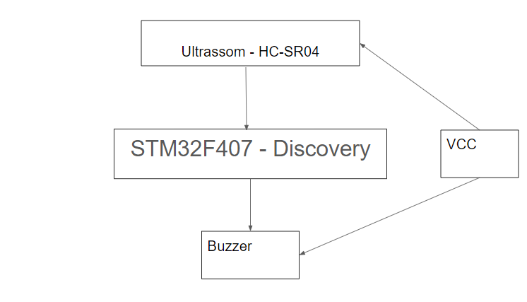

# Detector de Obstáculos

Implementação de um detetor de obstáculos utilizando um sensor de ultrassom e um buzzer utilizando a placa STM32F4 Discovery.

### Conceito e Motivação

Um dos maiores problemas enfrentados por pessoas com deficiência visual nos dias de hoje são os obstáculos aéreos. O auxílo de begalas ou de cães guia, previnem, em sua maioria, obstáculos que vão  dos pés até a cintura do usuário, porém, outros tipos de obstáculos como: galhos de árvore, orelhões, portas pequenas, portões e outros tipos empecilhos que podem existir no caminho do deficiente visual, não são detectados pelas bengalas ou pelos cães guia.

Assim, surgiu a ideia de criar um dispositivo que consiga detectar e avisar o deficiente visual a presença de um obstaculo aéreo. Este projeto consiste na implementação de um sensor de distância, baseado em ultrassom, e um buzzer em um microcontrolador, fazendo com que o usuário que utilize o dispositivo, possa se locomover de olhos vendados e sem se acidentar em nenhum obstáculo aereo que esteja em uma distância pré determinada de seus olhos.   

### Periféricos e Diagrama de Blocos

Este projeto vai ser feito com o uso de uma STM32F407Discovery um sensor de distância Ultrassônico HC-SR04 e um buzzer simples. Um sinal VCC vai alimentar o sensor ultrassom e o buzzer. As informações obtidas pelo sensor serão processadas pelo microcontroador, e caso haja a detecção, o buzzer vai emitir som, para assim poder aviasar o usuário. O diagrama de blocos do funcionamento se encontra abaixo.

### Referência Bibliográfica

1. Manual de Referência STM32F4
2. Datasheet HC-SR04
